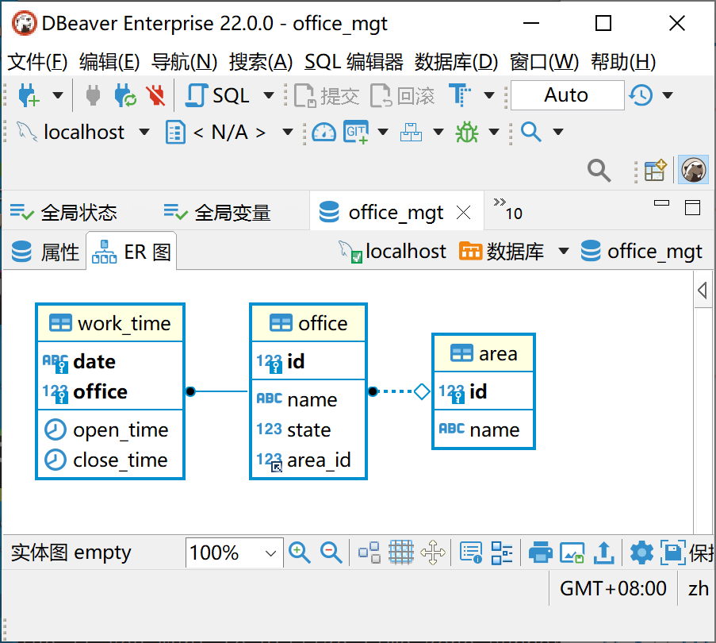

# 营业厅时间管理与分配系统

## 一、项目背景与需求分析

项目背景：
随着全球化的趋势和城市化进程，企业经常在多个地区和城市设有营业厅或办事处。为了确保各个营业厅能够准确、高效地为顾客提供服务，需要有一个系统来管理这些营业厅的营业时间。本项目的愿景是为企业提供一个灵活、可扩展且集成性强的营业时间管理系统，既可以满足现有的需求，又能为未来的智能视频分析工作提供支持。  

基础要求:  
使用BS架构模式，为m个地区的n个营业厅提供营业时间管理系统，要求可以设定每个营业厅的工作日和节假日的营业时间。后期该系统会被用于管理营业厅进行智能视频分析的时间。  
特殊要求:  
1.每个营业厅要求可以设置状态，包括“正常营业”和“暂停营业”，暂停营业的营业厅不可编辑时间。2.每个营业厅可以随时进行临时调休，调整其营业时间。  

## 二、环境与配置

系统环境：Windows 10 专业版 22H2。  
前端开发环境：Visual Studio Code。  
后端开发环境：Oracle OpenJDK version 20.0.2和IntelliJ IDEA Ultimate 2023.2.1。  
数据库环境：MySQl 8.0。  

## 三、项目架构与设计

### 前端部分

前端负责用户交互，用户可在前端进行营业厅的营业时间管理和营业时间查询。为实现编辑和查询，页面采取如下策略：

1. 营业厅管理页面要求可以显示和编辑每个营业厅的营业时间，营业状态。
2. 管理页面具有筛选功能，能够显示全部营业厅，或筛选出指定营业厅。
3. 按下编辑按钮后，弹出编辑后台信息的对话框。

该项目前端使用Vue.js渐进式JavaScript框架，使用Element-Plus桌面端组件库来快速搭建前端网页，使用Axios来发送和接受网页请求。  
前端工具介绍：

1. Vue.js：Vue.js（简称Vue）是一个开源的JavaScript框架，用于构建用户界面和单页面应用。
2. Element-Plus：Element-Plus是一个基于Vue 3的桌面端组件库，它提供了一整套高质量的组件和工具，用于快速构建富有特色的web应用。
3. Axios：Axios是一个基于Promise的HTTP客户端，用于浏览器和Node.js。其用于在前端应用中与后端API交互，发送GET、POST等请求。

前端结构介绍：  
该项目前端包含核心App.vue和四个组件datePicker.vue，infoEditor.vue，officeTable.vue和selectBox.vue。  
  
datePicker.vue：

- 简介：日期选择框，用来筛选日期以显示特定日期的营业厅营业时间。
- props：title，父组件传来的标题，显示在日期选择框上部。
- events：dateChange，在日期选择框日期改变时，向父组件触发dateChange事件。

infoEditor.vue：

- 简介：主弹窗组件，用于管理营业时间。
- props：clicks，用于触发弹窗显示的属性；info，存储从父组件传入的营业厅信息。
- methods：edit，存储用户输入的数据，并将其发送到后端。

officeTable.vue：

- 简介：营业厅营业时间表，用来显示营业厅营业时间。
- props：officeData，对象数组，是从父组件传入的机构数据；workTimeData，对象数组，是从父组件传入的工作时间数据。
- methods：getTableData，合并机构和工作时间数据；dialogPopUp，弹出数据编辑窗口。
- watchs：workTimeData，当其发生改变时，调用getTableData方法。
- events：在日期选择框日期改变时，会向父组件发出dateChange事件。

selectBox.vue：

- 简介：下拉选择框，当选择项改变时触发 valueChange 事件。
- props：title，父组件传来的标题，显示在下拉选择框中；options，下拉选项数据。
- events：在选中选项改变时，会向父组件发出valueChange事件。

### 后端部分

后端负责响应前端的网络请求、查询数据库并将数据返回给前端。  
该项目后端使用Java为开发语言，使用Java Spring框架，使用Apache-maven进行项目构建和依赖管理，使用mybatis和mybatis-plus进行数据库的连接。  
  
后端工具介绍：  

1. Java Spring：Spring Framework 是 Java 社区中最受欢迎和广泛使用的应用开发框架，能够轻松集成各种企业服务，例如 JMS、JPA 和 JNDI。此外，它与其他流行的 Java 框架（如 Hibernate、MyBatis 和 Quartz）完美集成。
2. Apache-maven: Maven 定义了一个清晰的生命周期，确保项目在不同环境中以一致的方式构建，通过中央仓库，Maven 可以自动下载项目所需的库和插件，并处理依赖关系，简化了版本控制和库的管理。
3. Mybatis和Mybatis-plus: MyBatis 专为确保直观、清晰和灵活的数据库交互而设计，与其他 ORM 框架不同，MyBatis 允许开发者编写原生 SQL，为复杂查询和优化提供了更大的控制力。此外，Mybatis支持自动将 SQL 查询结果转换为 Java 对象，减少了样板代码。

后端结构介绍：  
  
表示层：通常与前端交互，负责处理HTTP请求和返回响应。在本项目中，表示层文件位于com/example/officemgt/controller文件夹下。其中AreaController是一个REST控制器，处理与Area实体相关的HTTP请求（如areaQuery方法返回一个地点列表，用于前端查询地点的选择）。OfficeController和WorkTimeController分别负责Office实体和WorkTime实体相关的请求。  
  
实体层：定义了与数据库表对应的Java实体。在本项目中，实体层文件位于com/example/officemgt/entity文件夹下。本项目主要定义了三个实体：Area、Office和WorkTime。  
  
DAO层：直接与数据库交互，负责数据的CRUD操作。在本项目中，实体层文件位于com/example/officemgt/mapper文件夹下。本项目定义了AreaMapper、OfficeMapper和WorkTimeMapper这三个接口，用于处理与对应实体相关的数据库操作。  

### 数据库部分

该项目的数据库定义了area、office、work_time三个表，分别存储地区、营业厅、工作时间的信息，其中office表的area_id属性以area表中的id属性为外键，work_time表中的office属性以office表中的id属性为外键。地区和营业厅表中存储了所有地区和营业厅信息。而工作时间表的存储逻辑为：默认工作时间（8：00：00~17：00：00）不存储在表中，如果用户修改了工作时间，则将修改后的工作时间信息存储在表中。  

```SQL
create table `area`(
        `id` int primary key,
        `name` varchar(20)
);

create table `office`(
        `id` int primary key,
        `name` varchar(20),
        `state` boolean,
        `area_id` int,
        foreign key (`area_id`) references `area`(`id`) on delete cascade
);

create table `work_time`(
        `date` varchar(20),
        `office` int,
        `open_time` time,
        `close_time` time,
        primary key (`date`,`office`),
        foreign key (`office`) references `office`(`id`) on delete cascade
);
```

数据库ER图如下：  


主要的SQL查询过程：  
该系统的数据库部分主要涉及三个查询：

1. 查询区域
2. 根据区域查询营业厅
3. 根据日期信息和办公室id查询工作时间信息

数据库查询并不复杂，在此不再过多赘述。  

## 四、开发与部署

### 前端部分

安装依赖相关依赖项：

```
npm install
```

面向开发的编译和热重载

```
npm run serve
```

面向产业的编译和打包

```
npm run build
```

### 后端部分

通过Maven安装pom.xml中列出的所有依赖项。
在IntelliJ IDEA的Maven栏中双击package，会自动打包在项目路径文件夹的/target文件夹下。

## 五、项目未来计划

### 增强用户体验

- 实时更新: 当某个营业厅的营业时间有变化时，实时通知所有相关用户。
- 个性化设置: 允许每个营业厅自定义其营业时间模板，包括中间休息时间、特殊日期的特殊时间等。
- 界面优化: 提供更直观、简洁、用户友好的操作界面，以适应各种设备和屏幕尺寸。

### 数据分析与智能推荐

- 客流分析: 根据营业厅的客流量数据，提供营业时间的优化建议。
- 智能视频分析升级: 利用AI技术，分析视频数据，自动识别高峰时段、空闲时段等，并提供相应的调整建议。
- 用户反馈: 收集用户对营业时间的反馈，并根据反馈进行系统优化。

### 扩展功能

- 多语言支持: 考虑到m个地区可能涵盖多种语言，系统增加多语言界面。
- 假期调整: 根据各个地区的公共假期自动调整营业时间。
- 集成其他系统: 如集成支付系统、预约系统等，提供更加完善的服务。

### 安全性与稳定性提升

- 数据备份与恢复: 定期备份数据，并提供快速数据恢复功能。
- 权限管理: 确保只有授权的员工可以更改营业时间。
- 系统监控: 监控系统的运行状态，及时发现并处理任何问题。
